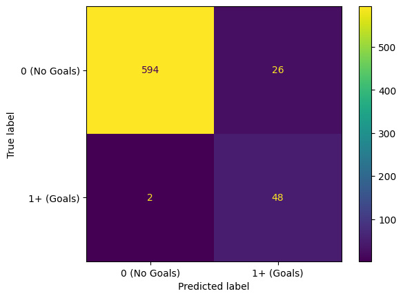

# Premier League Goal Prediction

## Overview

A machine learning project to predict whether a Premier League player will score a goal in a given match based on historical and current performance data. The project leverages engineered features, model optimization techniques, and handling of class imbalance to provide actionable insights for analysts, scouts, and clubs.

## Features

-   Predict whether a player will score in a given match.
-   Feature engineering to incorporate trends and contextual performance indicators.
-   Class imbalance handling with SMOTE.
-   Model optimization using Precision-Recall threshold tuning.
-   Provides insights into key predictors of goal-scoring.

## Installation:

1. Clone the repository:

```bash
git clone https://github.com/ericmckevitt/Premier-League-Performance-Prediction.git
cd Premier-League-Performance-Prediction
```

2. Install the required Python dependencies:

```bash
pip install -r requirements.txt
```

## Usage

1. Data Transformation

-   **Optional:** Use the `eda.ipynb` Jupyter notebook to transform the raw data (`dataset.csv`) into `processed.csv`.
-   **Note:** The `processed.csv` file is already included in the repository, so this step is optional unless you’d like to explore the transformation process.

2. Model Training and Prediction

-   Run the `prediction.ipynb` notebook to train a series of machine learning models that make iterative improvements upon one another.
-   The notebook demonstrates step-by-step improvements to model performance, with a focus on accurate goal predictions for rare events.

## Results

-   Final Random Forest Classifier:
    -   Class-accuracy: 96% for both “scored” and “not scored” classes.
    -   Improved recall for minority class through SMOTE and threshold optimization.
-   Key Predictors:
    -   Progressive carries, dribble attempts, days since last match, and rolling averages of goals scored.


